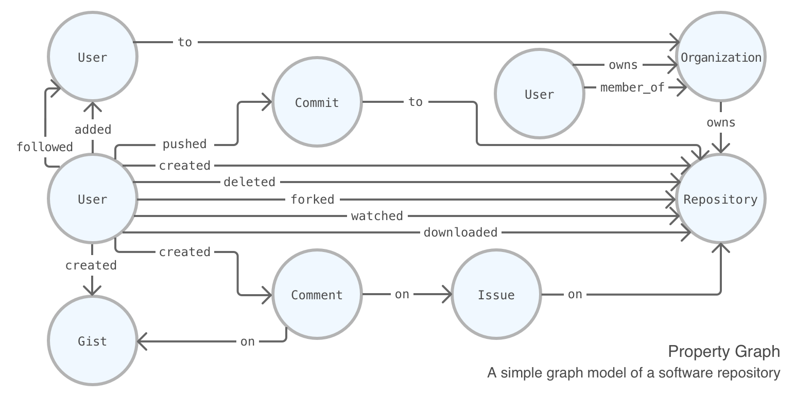

# Introduction {#intro}

## Why Model Data as a Graph?

Network graphs allow for relationship-based data models. Positioning the relationships between entities as first class lets us more easily model complex, real-world information. A distinguishing feature of network graph models is that the relationships are treated with as much value as the node entity data records themselves. The connections within data are often not considered but we really need to work closely with relationship data to extract valuable insights.

Using a network graph usually means you have fast navigation (i.e., traversals) between nodes (performed in constant time). Modeling data with a relational, tabular approach will require working with data as a set of tables and columns, and this necessitates carrying out complex joins and self-joins when the dataset becomes more interrelated. Such queries are technically complicated to construct and can be expensive to run. Furthermore, making them work synchronously is not easy, with performance dropping precipitously as the total dataset size increases. The tabular data model is also typically hard to reason about since it doesn't readily correspond to mental models for a given application.

## The DiagrammeR Graph Model

**DiagrammeR** provides a framework and collection of functions to model network graphs as property graphs. A property graph is one that has labeled nodes (for informational entities) that are connected via directed, typed relationships. Both nodes and relationships hold arbitrary properties (attributes, as key-value pairs). There is no rigid schema, but with node and edge labeling we can have as much metadata as we’d like. Taking the example of a typical software repository with multiple users, entities can be users, comments, issues, repositories, organizations, etc., and they are related to each other in specific ways. A user can create or delete a repository, and, the same user could also push a commit (a separate entity, having its own metadata) to a repository. The following schematic provides a simplified graph model of how entities can be related to each other in the context of an multiuser software repository.

A graph object in **DiagrammeR** maintains a series of interrelated elements. Most importantly, the set of nodes (vertices) and edges (links) resides here, along with elements for graph metadata such as styling attributes, active node/edge selections, data frames linked to nodes or edges, and other user-defined caches of graph features.

Nodes and edges contain attributes (properties) as key-value pairs. Formally, the graph object contains separate **R** data frames for nodes and their attributes and an analogous data frame for edges and their attributes. The user does not directly modify the contents of the graph object, rather, access to graph functions modifies the objects internal to the graph object, ensuring synchronization of all elements without corruption.

