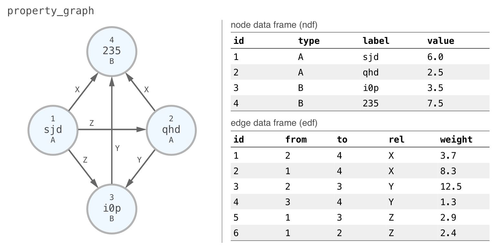
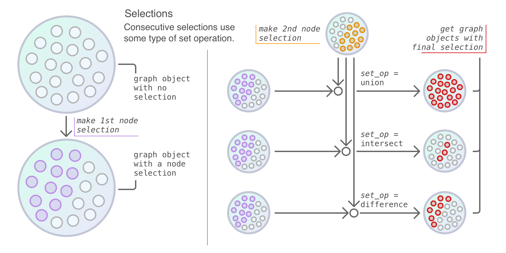

```{r load_dgr_04, include=FALSE, results=FALSE}
library(DiagrammeR)
```

```{r make_simple_property_graph, include=FALSE, results=FALSE}
property_graph <-
  create_random_graph(
    n = 4,
    m = 6,
    directed = TRUE,
    set_seed = 23) %>%
  select_nodes() %>%
  set_node_attrs(
    node_attr = "label",
    values = c("sjd", "qhd", "i0p", "235")) %>%
  set_node_attrs(
    node_attr = "type",
    values = c("A", "A", "B", "B")) %>%
  select_edges() %>%
  set_edge_attrs(
    edge_attr = "rel",
    values = c("X", "X", "Y", "Y", "Z", "Z")) %>%
  set_edge_attrs(
    edge_attr = "weight",
    values = c(3.7, 8.3, 12.5, 1.3, 2.9, 2.4)) %>%
  clear_selection()
```

# Selections {#selections}

Occasionally, you'll want to operate on a select group of nodes or edges. Some functions affect a single node or edge while others (or, sometimes, the same functions) operate on all nodes or edges in a graph. Selections allow you to target specified nodes or edges and then apply specialized functions to operate on just those selected entities. Most of the selection functions support rudimentary set operations across several calls of the selection functions (i.e., for the union, intersection, or difference between selected sets of nodes or edges).

## Setup for this Chapter

Ensure that the latest development build of **DiagrammeR** is installed. If the **devtools** package is not available in your **R** library, install it and then use the `install_github()` function to get the latest **DiagrammeR** build. 

```{r install_packages_dgr_chp_04, eval=FALSE, include=TRUE, results=FALSE}
install.packages("devtools")
devtools::install_github("rich-iannone/DiagrammeR")
```

```{r library_chp_04, eval=FALSE, include=TRUE, results=FALSE}
library(DiagrammeR)
```

For this chapter, the graph `property_graph` has been created and it's a simple property graph of 4 nodes and 6 edges. Numerical values are assigned to the nodes as the `value` attribute and to the edges as the `weight` attribute. Nodes have unique `label` values, and, `type` group labels are available for nodes (as `A` and `B`) and `rel` values are set for the edges (as `X`, `Y`, and `Z`). This schematic provides a visual representation of the graph as well as the attributes and data associated with each node and edge.



This graph adheres to the concept of a property graph in that:

- all nodes have an assigned, non-`NA` `type` value
- all edges have an assigned, non-`NA` `rel` value
- the graph is a *directed* graph

We can always verify whether a graph satisfies these conditions with the `is_property_graph()` function, which either returns a `TRUE` or `FALSE` logical result.

```{r is_property_graph}
is_property_graph(property_graph)
```

Great! We'll use this graph in most of the chapter examples to demonstrate how selections work. Working with a property graph in such examples is especially useful for showing how more complicated selections can be accomplished (i.e., using set operations and/or conditional statements).

## The Selection Functions

The following table provides a summary of all the available `select_...()` functions available in **DiagrammeR**.

```{r table_select_functions, echo=FALSE, results='asis'}
library(knitr)

kable(
  data.frame(
    Function = 
      c(
        "`select_nodes()`",
        "`select_nodes_by_id()`",
        "`select_last_nodes_created()`",
        "`select_nodes_by_degree()`",
        "`select_nodes_in_neighbourhood()`",
        "`select_edges()`",
        "`select_edges_by_edge_id()`",
        "`select_edges_by_node_id()`",
        "`select_last_edges_created()`",
        "`select_rev_edges_ws()`"
      ),
    Description = 
      c(
        "Select nodes graph using filtering conditions.",
        "Select nodes by their ID values.",
        "Select the last group of nodes created in the graph.",
        "Select nodes on the basis of node degree.",
        "Select nodes based on a walk distance from a specified node.",
        "Select nodes graph using filtering conditions.",
        "Select edges by their ID values.",
        "Select edges associated with specified node ID values.",
        "Select the last group of edges created in the graph.",
        "Select any reverse edges from a selection of edges."
        )))
```

When any selection is performed using a `select_...()` function, the selection is stored in the graph object. We can always use `get_selection()` to verify this:

```{r select_nodes_get_selection}
# Select nodes `1` and `4` of
# `property_graph` and then return
# the node IDs for the selection
property_graph %>%
  select_nodes(nodes = c(1, 4)) %>%
  get_selection()
```

And indeed the selection we get back is the selection we asked for, nodes `1` and `4`. We can similarly get a selection of edge ID values and return a vector of edge IDs with `get_selection()`:

```{r select_nodes_get_selection_2}
# Select edges `1` and `4` of
# `property_graph` and then return
# the node IDs for the selection
property_graph %>%
  select_edges_by_edge_id(edges = c(1, 4)) %>%
  get_selection()
```

## Creating a Node Selection

Let's begin our in-depth look at how to select graph nodes using the `select_nodes()` function. 
Selecting nodes in a graph with `select_nodes()` can be done in multiple ways:

- providing only a set of node ID values
- by providing one or more filtering statements to `conditions`
- doing both of the above, where each set of values/statements work toward filtering the nodes that will comprise the node selection

The first example using `select_nodes()` will pertain to the first case, where you know which node ID values should make up the node selection. To show the node selection with all associated metadata as a node data frame, we'll use 2 functions after the selection: `create_subgraph_ws()` (creates a subgraph, or subset, with only the selected nodes), and, `get_node_df()` (returns a node data frame for all nodes in the graph, now limited by the nodes in the selection).

```{r select_nodes_2_ids, eval=FALSE, include=TRUE}
# From `property_graph`, select nodes
# `1` and `3`; show the ndf based on
# the node selection
property_graph %>%
  select_nodes(nodes = c(1, 3)) %>%
  create_subgraph_ws() %>%
  get_node_df()
```

```{r select_nodes_2_ids_kable, echo=FALSE}
knitr::kable(
  property_graph %>%
    select_nodes(nodes = c(1, 3)) %>%
    create_subgraph_ws() %>%
    get_node_df()
)
```


The `select_nodes_by_id()` function serves as a plug-in replacement for `select_nodes()` when used exactly in this way. Its `nodes` argument simply takes a vector of node ID values. Passing in the same node ID values will result in the same node data frame as in the previous example.

```{r select_nodes_by_id_2_ids, eval=FALSE, include=TRUE}
# Select nodes `1` and `3` using the
# `select_nodes_by_id()` function
property_graph %>%
  select_nodes_by_id(nodes = c(1, 3)) %>%
  create_subgraph_ws() %>%
  get_node_df()
```

```{r select_nodes_by_id_2_ids_kable, echo=FALSE}
knitr::kable(
  property_graph %>%
    select_nodes_by_id(nodes = c(1, 3)) %>%
    create_subgraph_ws() %>%
    get_node_df()
)
```

If you don't know the node ID values that should be part of a selection - and this is often the case in practice - you can use a vector of filtering statements as `conditions`. Some of these can be `conditions = "type == 'z'"` (selecting nodes where the `type` value is `z`), or `conditions = "value > 3.0"` (node selection where the `value` attribute is greater than `3.0`), or, `conditions = c("value < 2.0", "type %in% c('a', 'b', 'd')")` (all nodes with `value` less than `2.0` and having a `type` value of `a`, `b`, or `d`). Here's an example using an `==` operator to get all nodes of `type` `A`:

```{r select_nodes_type_A, eval=FALSE, include=TRUE}
# From our `property_graph`, select all
# nodes of type `A`
property_graph %>%
  select_nodes(
    conditions = "type == 'A'") %>%
  create_subgraph_ws() %>%
  get_node_df()
```

```{r select_nodes_type_A_kable, echo=FALSE}
knitr::kable(
  property_graph %>%
    select_nodes(
      conditions = "type == 'A'") %>%
    create_subgraph_ws() %>%
    get_node_df()
)
```

Need more than one type? Use the familiar `%in%` operator to get nodes with a `type` of `A` or `B`.

```{r select_nodes_types_A_B, eval=FALSE, include=TRUE}
# From our `property_graph`, select all
# nodes of type `A`
property_graph %>%
  select_nodes(
    conditions = "type %in% c('A', 'B')") %>%
  create_subgraph_ws() %>%
  get_node_df()
```

```{r select_nodes_types_A_B_kable, echo=FALSE}
knitr::kable(
  property_graph %>%
    select_nodes(
      conditions = "type %in% c('A', 'B')") %>%
    create_subgraph_ws() %>%
    get_node_df()
)
```

Regular expressions can also be used. Suppose we want nodes in this graph where the label only consists of 3 letters, and no numerals. To do this, we could use the **R** `grepl()` function with the regular expression (`^[a-z]{3}$`) first and then the attribute where matches are sought (in this case, `label`).

```{r select_nodes_cond_regex, eval=FALSE, include=TRUE}
property_graph %>%
  select_nodes(conditions = "grepl('^[a-z]{3}$', label)") %>%
  create_subgraph_ws() %>%
  get_node_df()
```

```{r select_nodes_cond_regex_kable, echo=FALSE}
knitr::kable(
  property_graph %>%
    select_nodes(conditions = "grepl('^[a-z]{3}$', label)") %>%
    create_subgraph_ws() %>%
    get_node_df()
)
```

Comparison operators such as `>`, `>=`, `==`, `<=`, `<`, `!=` could be used with numerical attributes to filter nodes. Here, we make a selection of nodes where any `value` is greater than `4.0`.

```{r select_nodes_cond_gt_numeric, eval=FALSE, include=TRUE}
# Now, get all nodes with a `value`
# greater than 4.0
property_graph %>%
  select_nodes(
    conditions = "value > 4.0") %>%
  create_subgraph_ws() %>%
  get_node_df()
```

```{r select_nodes_cond_gt_numeric_kable, echo=FALSE}
knitr::kable(
  property_graph %>%
    select_nodes(
      conditions = "value > 4.0") %>%
    create_subgraph_ws() %>%
    get_node_df()
)
```

We can extend any conditions string to contain multiple filtering steps, linked by `&` (`AND`) or `|` (`OR`) operators. To select nodes that have a `value` less than `3.0` or a `value` greater than `7.0`, the following will work:

```{r select_nodes_or_cond, eval=FALSE, include=TRUE}
property_graph %>%
  select_nodes(
    conditions = "value < 3.0 | value > 7.0") %>%
  create_subgraph_ws() %>%
  get_node_df()
```

```{r select_nodes_or_cond_kable, echo=FALSE}
knitr::kable(
  property_graph %>%
    select_nodes(
      conditions = "value < 3.0 | value > 7.0") %>%
    create_subgraph_ws() %>%
    get_node_df()
)
```

To get a selection of nodes that must satisfy all conditions, link expressions with `&`. The following example will filter nodes with a `value` greater than `4.0`, and, with a `type` of `A`:

```{r select_nodes_and_cond, eval=FALSE, include=TRUE}
property_graph %>%
  select_nodes(
    conditions = "value > 4.0 & type == 'A'") %>%
  create_subgraph_ws() %>%
  get_node_df()
```

```{r select_nodes_and_cond_kable, echo=FALSE}
knitr::kable(
  property_graph %>%
    select_nodes(
      conditions = "value > 4.0 & type == 'A'") %>%
    create_subgraph_ws() %>%
    get_node_df()
)
```

A vector of `condition` statements creates a set of `AND` conditions, where all conditions need to be fulfilled. The above example could be reworked using a vector of `conditions` statements:

```{r select_nodes_and_cond_vector, eval=FALSE, include=TRUE}
property_graph %>%
  select_nodes(
    conditions = c("value > 4.0", "type == 'A'")) %>%
  create_subgraph_ws() %>%
  get_node_df()
```

```{r select_nodes_and_cond_vector_kable, echo=FALSE}
knitr::kable(
  property_graph %>%
    select_nodes(
      conditions = c("value > 4.0", "type == 'A'")) %>%
    create_subgraph_ws() %>%
    get_node_df()
)
```

This retrieves the same selection and is useful for `AND`ing a sequence of filter statements.

The situation may arise when an even more specialized selection of nodes needs to be made. Or, you'd like to make a selection, do something with it, then modify the selection (and then do yet another thing). This is where the `set_op` argument (short for *set operation*) becomes useful. Essentially the first selection will disregard `set_op`--it's just making an initial selection--but the next selection will modify the previous one and how it does so depends on what's given for `set_op`.

These set operations are:

* `union` — creates a union of selected nodes in consecutive operations that create a selection of nodes (this is the default option)
* `intersect` — modifies the list of selected nodes such that only those nodes common to both consecutive node selection operations will retained
* `difference` — modifies the list of selected nodes such that the only nodes retained are those that are different in the second node selection operation compared to the first

This schematic describes what's happening in 2 consecutive `select_...()` function calls for each of the aforementioned set operations.



These set operations behave in exactly the same way as the base **R** functions `union()`, `intersect()`, and `setdiff()`. Furthermore, most of the `select_...()` functions contain the `set_op` argument, so, they behave the same way with regard to modifying the node or edge selection in a series of consecutive selection operations.

For our small property graph with 4 nodes (with IDs `1` through `4`), creating an initial selection of nodes with `select_nodes()` will result in the selection of all 4 nodes in the graph. A subsequent call of `select_nodes_by_id()` specifying `nodes = c(1, 3)` and `set_op = "difference"` will result in a selection of nodes `2` and `4` (the difference of removing `1` and `3` from the complete set). Let's verify the final selection by finishing with `get_selection()` this time, which outputs node ID values for the selected nodes.

```{r select_nodes_2x_w_difference}
property_graph %>%
  select_nodes() %>%
  select_nodes_by_id(
    nodes = c(1, 3),
    set_op = "difference") %>%
  get_selection()
```

For a somewhat more realistic application, where the node IDs are not known, imagine a situation where you would want to select nodes of a certain degree but only those having a certain value range. Here, we do something to that effect, where we want to select nodes with an *outdegree* (number of outward edges from a given node) greater than `1` with the added condition of having a `value` greater than `4.0`. In this case, we want the intersection of these selections.

```{r select_nodes_by_degree_and_value, eval=FALSE, include=TRUE}
property_graph %>%
  select_nodes_by_degree(
    expressions = "outdeg > 1") %>%
  select_nodes(
    conditions = "value > 4.0",
    set_op = "intersect") %>%
  create_subgraph_ws() %>%
  get_node_df()
```

```{r select_nodes_by_degree_and_value_kable, echo=FALSE}
knitr::kable(
  property_graph %>%
    select_nodes_by_degree(
      expressions = "outdeg > 1") %>%
    select_nodes(
      conditions = "value > 4.0",
      set_op = "intersect") %>%
    create_subgraph_ws() %>%
    get_node_df()
)
```

This returns a single value. Just so you know, using `set_op == "union"` would result in 3 nodes in the selection (`1`, `2`, and `4`), and, using `set_op == "difference"` would yield a selection with the node `2`.

Most often, selections will be performed without knowing the node ID values for the nodes to be selected but, instead, some attributes of the nodes to be selected and perhaps the nodes to exclude from that selection. And this sort of makes sense when you have thousands, hundreds of thousands, and maybe millions of nodes: you're not often going to visualize the entire graph at this point (much like you wouldn't usually  display a table of even hundreds of rows).

## Creating an Edge Selection

We'll run through selections of edges in perhaps an abbreviated fashion since many of the concepts that apply to node selections also apply to edge selections. First off, recall that edges have ID values! This is great because edges can also be defined by their attachments to nodes. So an edge defined as `1->2` in a directed graph (where `1` and `2` are node ID values) can also be defined as an edge with ID `1` (in this hypothetical case). Let's have a look at the internal edge data frame within `property_graph` to remind ourselves of the edge ID values available in this graph:

```{r get_edge_df_all_edges, eval=FALSE, include=TRUE}
property_graph %>%
  get_edge_df()
```

```{r get_edge_df_all_edges_kable, echo=FALSE}
knitr::kable(
  property_graph %>%
    get_edge_df()
)
```

The first column in the edge data frame is the `id` attribute. The next two are `from` and `to`, and `rel` is always the 4th attribute column. We can select edges using IDs (of both the edge and node varieties) with three different functions:

- `select_edges()`
- `select_edges_by_edge_id()`
- `select_edges_by_node_id()`

