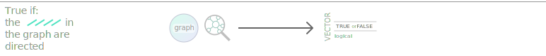
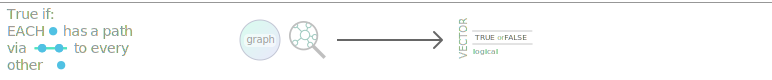
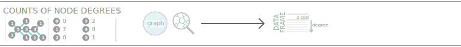

# Functions: Inspection {#fcns_inspection}

## `node_info()`

<h4><em>Get detailed information on nodes</em></h4>

<h5>DESCRIPTION</h5>

Obtain a data frame with detailed information on nodes and their interrelationships within a graph.

<h5>PARAMETERS</h5>

**`graph`** a graph object of class `dgr_graph`.

## `edge_info()`

<h4><em>Get detailed information on edges</em></h4>

<h5>DESCRIPTION</h5>

Obtain a data frame with detailed information on edges and their interrelationships within a graph.

<h5>PARAMETERS</h5>

**`graph`** a graph object of class `dgr_graph`.

## `graph_info()`

<h4><em>Get metrics for a graph</em></h4>

<h5>DESCRIPTION</h5>

Get a data frame with metrics for a graph.

<h5>PARAMETERS</h5>

**`graph`** a graph object of class `dgr_graph`.

## `get_node_ids()`

<h4><em>Get a vector of node ID values</em></h4>

<h5>DESCRIPTION</h5>

Obtain a vector of node ID values from a graph object or a node data frame. An optional filter by node attribute can limit the set of node ID values returned.

<h5>PARAMETERS</h5>

**`x`** either a graph object of class `dgr_graph` or a node data frame.

**`conditions`** an option to use filtering conditions for the retrieval of nodes.

## `get_edge_ids()`

<h4><em>Get a vector of edge ID values</em></h4>

<h5>DESCRIPTION</h5>

Obtain a vector of edge ID values from a graph object. An optional filter by edge attribute can limit the set of edge ID values returned.

<h5>PARAMETERS</h5>

**`graph`** a graph object of class `dgr_graph`.

**`conditions`** an option to use filtering conditions for the retrieval of edges.

## `get_edges()`

<h4><em>Get node IDs associated with edges</em></h4>

<h5>DESCRIPTION</h5>

Obtain a vector, data frame, or list of node IDs from a graph object or an edge data frame. An optional filter by edge attribute can limit the set of edges returned.

<h5>PARAMETERS</h5>

**`x`** either a graph object of class `dgr_graph` or an edge data frame.

**`conditions`** an option to use filtering conditions for the retrieval of edges.

**`return_type`** using `vector` (the default), a vector of character objects representing the edges is provided. With `list` a list object will be provided that contains vectors of outgoing and incoming node IDs associated with edges. With `df`, a data frame containing outgoing and incoming node IDs associated with edges.

**`return_values`** using `id` (the default) results in node ID values returned in the edge definitions. With `label`, the node labels will instead be used to define edges.

## `get_predecessors()`

<h4><em>Get node IDs for predecessor nodes to the specified node</em></h4>

<h5>DESCRIPTION</h5>

Provides a vector of node IDs for all nodes that have a connection to the given node.

<h5>PARAMETERS</h5>

**`graph`** a graph object of class `dgr_graph`.

**`node`** a node ID for the selected node.

## `get_successors()`

<h4><em>Get node IDs for successor nodes to the specified node</em></h4>

<h5>DESCRIPTION</h5>

Provides a vector of node IDs for all nodes that have a connection from the given node.

<h5>PARAMETERS</h5>

**`graph`** a graph object of class `dgr_graph`.

**`node`** a node ID for the selected node.

## `get_node_df()`

<h4><em>Get a node data frame from a graph</em></h4>

<h5>DESCRIPTION</h5>

From a graph, obtain a node data frame with all current node attributes.

<h5>PARAMETERS</h5>

**`graph`** a graph object of class `dgr_graph`.

## `get_edge_df()`

<h4><em>Get an edge data frame from a graph</em></h4>

<h5>DESCRIPTION</h5>

From a graph, obtain an edge data frame with all current edge attributes.

<h5>PARAMETERS</h5>

**`graph`** a graph object of class `dgr_graph`.

## `node_count()`

<h4><em>Get count of all nodes or certain types of nodes</em></h4>

<h5>DESCRIPTION</h5>

From a graph object of class `dgr_graph`, get a count of nodes in the graph and optionally obtain a count of nodes by their type.

<h5>PARAMETERS</h5>

**`graph`** a graph object of class `dgr_graph`.

**`type`** either a logical value, where `TRUE` provides a named vector of node count by type and `FALSE` (the default) provides a total count, or, a character vector of `type` values to filter the node count.

## `edge_count()`

<h4><em>Get count of all edges or edges with distinct relationship types</em></h4>

<h5>DESCRIPTION</h5>

From a graph object of class `dgr_graph`, get a count of edges in the graph and optionally obtain a count of edges by their relationship type.

<h5>PARAMETERS</h5>

**`graph`** a graph object of class `dgr_graph`.

**`rel`** either a logical value, where `TRUE` provides a named vector of edge count by type and `FALSE` (the default) provides a total count of edges, or, a string corresponding to one or more edge relationship types.

## `node_present()`

<h4><em>Determine whether a specified node is present</em></h4>

<h5>DESCRIPTION</h5>

From a graph object of class `dgr_graph`, determine whether a specified node is present.

<h5>PARAMETERS</h5>

**`graph`** a graph object of class `dgr_graph`.

**`node`** a value that may or may not match a node ID in the graph.

## `edge_present()`

<h4><em>Determine whether a specified edge is present</em></h4>

<h5>DESCRIPTION</h5>

From a graph object of class `dgr_graph`, determine whether a directed edge (defined by a pair of node IDs extant in the graph) is present.

<h5>PARAMETERS</h5>

**`graph`** a graph object of class `dgr_graph`.

**`from`** a node ID from which the edge to be queried is outgoing.

**`to`** a node ID to which the edge to be queried is incoming.

## `is_graph_empty()`

<h4><em>Is the graph empty?</em></h4>

<h5>DESCRIPTION</h5>

Provides a logical value on whether the graph is empty (i.e., contains no nodes).

<h5>PARAMETERS</h5>

**`graph`** a graph object of class `dgr_graph`.

## `is_graph_directed()`

<h4><em>Is the graph a directed graph?</em></h4>

<h5>DESCRIPTION</h5>

Determines whether a graph is set to be directed or not and returns a logical value to that effect.

<h5>PARAMETERS</h5>

**`graph`** a graph object of class `dgr_graph`.

## `is_graph_connected()`

<h4><em>Is the graph a connected graph?</em></h4>

<h5>DESCRIPTION</h5>

Determines whether a graph is a connected graph.

<h5>PARAMETERS</h5>

**`graph`** a graph object of class `dgr_graph`.

## `is_property_graph()`

<h4><em>Is the graph a property graph?</em></h4>

<h5>DESCRIPTION</h5>

Provides a logical value on whether the graph is property graph (i.e., all nodes have an assigned `type` value and all edges have an assigned `rel` value).

<h5>PARAMETERS</h5>

**`graph`** a graph object of class `dgr_graph`.

## `get_degree_in()`

<h4><em>Get indegree values for all nodes</em></h4>

<h5>DESCRIPTION</h5>

Get the indegree values for all nodes in a graph.

<h5>PARAMETERS</h5>

**`graph`** a graph object of class `dgr_graph`.

**`normalized`** set as `FALSE` (the default), the the indegree will be provided for each of the nodes (as a count of edges to each node). When set as `TRUE`, then the result for each node will be divided by the total number of nodes in the graph minus 1.

## `get_degree_out()`

<h4><em>Get outdegree values for all nodes</em></h4>

<h5>DESCRIPTION</h5>

Get the outdegree values for all nodes in a graph.

<h5>PARAMETERS</h5>

**`graph`** a graph object of class `dgr_graph`.

**`normalized`** set as `FALSE` (the default), the the outdegree will be provided for each of the nodes (as a count of edges outgoing from each node). When set as `TRUE`, then the result for each node will be divided by the total number of nodes in the graph minus 1.

## `get_degree_total()`

<h4><em>Get total degree values for all nodes</em></h4>

<h5>DESCRIPTION</h5>

Get the total degree values for all nodes in a graph.

<h5>PARAMETERS</h5>

**`graph`** a graph object of class `dgr_graph`.

**`normalized`** set as `FALSE` (the default), the the total degree will be provided for each of the nodes (as a count of edges to and from each node). When set as `TRUE`, then the result for each node will be divided by the total number of nodes in the graph minus 1.

## `get_degree_histogram()`

<h4><em>Get histogram data for a graph's degree frequency</em></h4>

<h5>DESCRIPTION</h5>

Get histogram data for a graph's degree frequency. The bin width is set to 1 and zero-value degrees are omitted from the output.

<h5>PARAMETERS</h5>

**`graph`** a graph object of class `dgr_graph`.

## `get_degree_distribution()`

<h4><em>Get degree distribution data for a graph</em></h4>

<h5>DESCRIPTION</h5>

Get degree distribution data for a graph. Graph degree is represented as a frequency of degree values over all nodes in the graph.

<h5>PARAMETERS</h5>

**`graph`** a graph object of class `dgr_graph`.

## `get_graph_diameter()`

<h4><em>Get the graph diameter</em></h4>

<h5>DESCRIPTION</h5>

Get the graph diameter, which is the maximum eccentricity.

<h5>PARAMETERS</h5>

**`graph`** a graph object of class `dgr_graph`.

## `get_constraint()`

<h4><em>Get constraint scores for one or more graph nodes</em></h4>

<h5>DESCRIPTION</h5>

Get the constraint scores (based on Burt's Constraint Index) for one or more nodes in a graph.

<h5>PARAMETERS</h5>

**`graph`** a graph object of class `dgr_graph`.

**`nodes`** an optional vector of node IDs to consider for constraint scores. If not supplied, then constraint scores for all nodes in the graph will be calculated.

## `get_betweenness()`

<h4><em>Get betweenness centrality scores</em></h4>

<h5>DESCRIPTION</h5>

Get the betweenness centrality scores for all nodes in a graph.

<h5>PARAMETERS</h5>

**`graph`** a graph object of class `dgr_graph`.

## `get_closeness()`

<h4><em>Get closeness centrality values</em></h4>

<h5>DESCRIPTION</h5>

Get the closeness centrality values for all nodes in a graph.

<h5>PARAMETERS</h5>

**`graph`** a graph object of class `dgr_graph`.

**`direction`** using `all` (the default), the search will ignore edge direction while traversing through the graph. With `out`, measurements of paths will be from a node whereas with `in`, measurements of paths will be to a node.

## `get_bridging()`

<h4><em>Get bridging scores</em></h4>

<h5>DESCRIPTION</h5>

Get the bridging scores (based on Valente's Bridging vertex measure) for all nodes in a graph.

<h5>PARAMETERS</h5>

**`graph`** a graph object of class `dgr_graph`.

## `get_eccentricity()`

<h5>DESCRIPTION</h5>

<h4><em>Get node eccentricities</em></h4>

Get a named vector or data frame with node eccentricity values.

<h5>PARAMETERS</h5>

**`graph`** a graph object of class `dgr_graph`.

**`nodes`** an optional vector of node IDs for filtering the list of nodes present in the graph.

**`return_type`** using `vector` (the default) will provide a named vector of eccentricity values (the node IDs serve as names). With `df`, a data frame containing node IDs and eccentricity values is provided.

## `get_jaccard_similarity()`

<h4><em>Get Jaccard similarity coefficient scores</em></h4>

<h5>DESCRIPTION</h5>

Get the Jaccard similiarity coefficient scores for one or more nodes in a graph.

<h5>PARAMETERS</h5>

**`graph`** a graph object of class `dgr_graph`.

**`nodes`** an optional vector of node IDs to consider for Jaccard similarity scores. If not supplied, then similarity scores will be provided for every pair of nodes in the graph.

**`direction`** using `all` (the default), the function will ignore edge direction when determining scores for neighboring nodes. With `out` and `in`, edge direction for neighboring nodes will be considered.

**`round_to`** the maximum number of decimal places to retain for the Jaccard similarity coefficient scores. The default value is `3`.

## `get_dice_similarity()`

<h4><em>Get Dice similarity coefficient scores</em></h4>

<h5>DESCRIPTION</h5>

Get the Dice similiarity coefficient scores for one or more nodes in a graph.

<h5>PARAMETERS</h5>

**`graph`** a graph object of class `dgr_graph`.

**`nodes`** an optional vector of node IDs to consider for Dice similarity scores. If notsupplied, then similarity scores will be provided for every pair of nodes in the graph.

**`direction`** using `all` (the default), the function will ignore edge direction when determining scores for neighboring nodes. With `out` and `in`, edge direction for neighboring nodes will be considered.

**`round_to`** the maximum number of decimal places to retain for the Dice similarity coefficient scores. The default value is \code{3}.

## `get_periphery()`

<h4><em>Get nodes that form the graph periphery</em></h4>

<h5>DESCRIPTION</h5>

Get those nodes that are part of the graph periphery (i.e., have the maximum eccentricity in the graph).

<h5>PARAMETERS</h5>

**`graph`** a graph object of class `dgr_graph`.

## `get_cmty_walktrap()`

<h4><em>Get community membership using the Walktrap method</em></h4>

<h5>DESCRIPTION</h5>

With the Walktrap community finding algorithm, obtain the group membership values for each of the nodes in the graph.

<h5>PARAMETERS</h5>

**`graph`** a graph object of class `dgr_graph`.

**`steps`** the number of steps to take for each of the random walks.

## `get_cmty_louvain()`

<h4><em>Get community membership by Louvain optimization</em></h4>

<h5>DESCRIPTION</h5>

Through the use of multi-level optimization of a modularity score, obtain the group membership values for each of the nodes in the graph.

<h5>PARAMETERS</h5>

**`graph`** a graph object of class `dgr_graph`.

## `get_cmty_l_eigenvec()`

<h4><em>Get community membership by leading eigenvector</em></h4>

<h5>DESCRIPTION</h5>

Through the calculation of the leading non-negative eigenvector of the modularity matrix of the graph, obtain the group membership values for each of the nodes in the graph.

<h5>PARAMETERS</h5>

**`graph`** a graph object of class `dgr_graph`.

## `get_cmty_fast_greedy()`

<h4><em>Get community membership by modularity optimization</em></h4>

<h5>DESCRIPTION</h5>

Through the use of greedy optimization of a modularity score, obtain the group membership values for each of the nodes in the graph.

<h5>PARAMETERS</h5>

**`graph`** a graph object of class `dgr_graph`.

## `get_cmty_edge_btwns()`

<h4><em>Get community membership by edge betweenness</em></h4>

<h5>DESCRIPTION</h5>

Using edge betweenness, obtain the group membership values for each of the nodes in the graph.

<h5>PARAMETERS</h5>

**`graph`** a graph object of class `dgr_graph`.

## `get_nbrs()`

<h4><em>Get all neighbors of one or more nodes</em></h4>

<h5>DESCRIPTION</h5>

With one or more nodes, get the set of all neighboring nodes.

<h5>PARAMETERS</h5>

**`graph`** a graph object of class `dgr_graph`.

**`nodes`** a vector of node ID values.

## `get_non_nbrs()`

<h4><em>Get non-neighbors of a node in a graph</em></h4>

<h5>DESCRIPTION</h5>

Get the set of all nodes not neighboring a single graph node.

<h5>PARAMETERS</h5>

**`graph`** a graph object of class `dgr_graph`.

**`node`** a single-length vector containing a node ID value.

## `get_common_nbrs()`

<h4><em>Get all common neighbors between two or more nodes</em></h4>

<h5>DESCRIPTION</h5>

With two or more nodes, get the set of common neighboring nodes.

<h5>PARAMETERS</h5>

**`graph`** a graph object of class `dgr_graph`.

**`nodes`** a vector of node ID values of length at least 2.

## `get_similar_nbrs()`

<h4><em>Get neighboring nodes based on node attribute similarity</em></h4>

<h5>DESCRIPTION</h5>

With a graph a single node serving as the starting point, get those nodes in a potential neighborhood of nodes (adjacent to the starting node) that have a common or similar (within threshold values) node attribute to the starting node.

<h5>PARAMETERS</h5>

**`graph`** a graph object of class `dgr_graph`.

**`node`** a single-length vector containing a node ID value.

**`node_attr`** the name of the node attribute to use to compare with adjacent nodes.

**`tol_abs`** if the values contained in the node attribute `node_attr` are numeric, one can optionally supply a numeric vector of length 2 that provides a lower and upper numeric bound as criteria for neighboring node similarity to the starting node.

**`tol_pct`** if the values contained in the node attribute `node_attr` are numeric, one can optionally supply a numeric vector of length 2 that specifies lower and upper bounds as negative and positive percentage changes to the value of the starting node. These bounds serve as criteria for neighboring node similarity to the starting node.

## `get_paths()`

<h4><em>Get paths from a specified node in a directed graph</em></h4>

<h5>DESCRIPTION</h5>

Obtain a list of all possible paths from a given node within a directed graph.

<h5>PARAMETERS</h5>

**`graph`** a graph object of class `dgr_graph`.

**`from`** the node from which all paths will be determined.

**`to`** the node to which all paths will be determined.

**`shortest_path`** an option to return paths that are the shortest in the set of all determined paths.

**`longest_path`** an option to return paths that are the longest in the set of all determined paths.

**`distance`** a vector of integer values that specify which of the valid paths to return when filtering by distance.

## `get_w_connected_cmpts()`

<h4><em>Get all nodes associated with connected components</em></h4>

<h5>DESCRIPTION</h5>

Determine which nodes in a graph belong to different weakly connected components (i.e., distinct sets of nodes with traversable paths to and from each node in the set).

<h5>PARAMETERS</h5>

**`graph`** a graph object of class `dgr_graph`.

## `get_s_connected_cmpts()`

<h4><em>Get nodes within strongly connected components</em></h4>

<h5>DESCRIPTION</h5>

Determine which nodes in a graph belong to different strongly connected components.

<h5>PARAMETERS</h5>

**`graph`** a graph object of class `dgr_graph`.

## `get_articulation_points()`

<h4><em>Get articulation points</em></h4>

<h5>DESCRIPTION</h5>

Get the nodes in the graph that are identified as articulation points.

<h5>PARAMETERS</h5>

**`graph`** a graph object of class `dgr_graph`.
